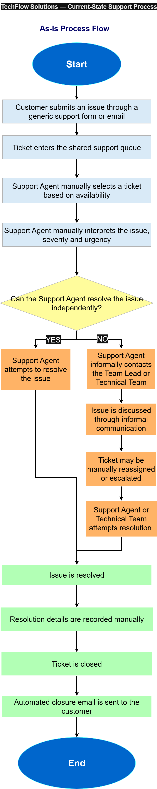

# TechFlow-support-prioritization

## Project Overview
**About TechFlow**

TechFlow Solutions is a simulated mid-sized B2B SaaS company providing project-management and workflow software to approximately **600 business customer accounts** across Starter, Business and Enterprise subscription plans.
The customer-support function handles approximately **350 tickets per business day** through a team of **15 Support Agents, one Team Lead and one Customer Support Head**. A System Administrator is responsible for managing approved operational rules.

**About the project**

TechFlow Support Prioritization is a planning-stage Business Analyst portfolio project created to define a more structured approach to customer-support ticket handling. The proposed solution covers structured ticket intake, classification, severity and priority assessment, agent routing, SLA monitoring, escalation, customer communication, operational reporting and controlled rule configuration.

**Project positioning:** This project demonstrates how I translated an operational support problem into documented requirements, business rules, current-state and future-state processes, prioritized Jira backlog items, low-fidelity wireframes, UAT scenarios and requirements traceability.

### Project files
[View Case Study here.](https://github.com/Megh01744/TechFlow-support-prioritization/blob/main/docs/TechFlow_BA_Portfolio_Case_Study_.pdf)

[Explore Requirements Workbook here.](https://github.com/Megh01744/TechFlow-support-prioritization/blob/main/requirements/TechFlow_BA_Requirements_Workbook.xlsx)

[Review Jira Backlog here.](https://github.com/Megh01744/TechFlow-support-prioritization/blob/main/jira/TechFlow_Jira_Backlog.csv)

## Business Problem

TechFlow’s existing support process relies heavily on manual judgement. Tickets may enter through a generic support form or email with incomplete information and then move into a shared queue without consistently assigned categories, severity levels or priorities.

### Current State (As-Is)

In the current support process, customer requests enter through a generic support form or email and move into a shared queue. Because structured classification, SLA monitoring and escalation controls are limited, Support Agents rely heavily on manual judgement.

- Tickets enter a shared queue with incomplete or unclear information.
- Category, severity and priority decisions vary between agents.
- Agents manually select and assign tickets.
- SLA risks are often identified after delays occur.
- Escalations and customer updates are handled inconsistently.

### Proposed Future State (To-Be)

The proposed future-state process introduces structured information capture, approved decision rules and defined operational controls. Routine decisions would be supported by the system, while uncertain or exceptional cases would remain available for human review.

- Structured intake captures complete issue, impact and account information.
- Approved rules support category, severity and priority decisions.
- Tickets are routed using skills, availability, workload and P1 eligibility.
- SLA warnings and defined escalation triggers support earlier intervention.
- Customer updates and key ticket changes are recorded for traceability.

