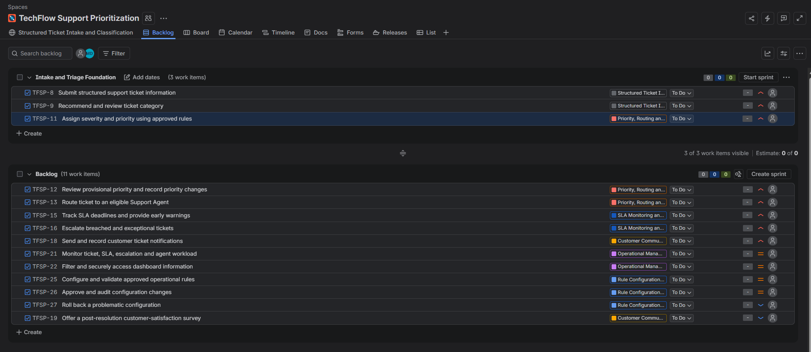
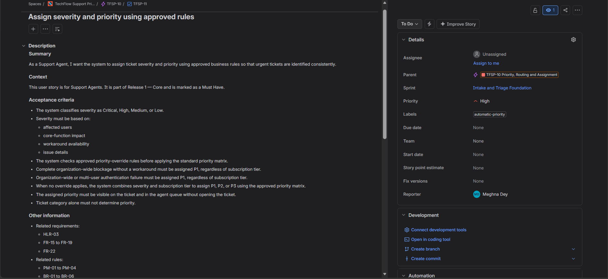

# TechFlow-support-prioritization

## Project Overview
**About TechFlow**

TechFlow Solutions is a simulated mid-sized B2B SaaS company providing project-management and workflow software to approximately **600 business customer accounts** across Starter, Business and Enterprise subscription plans.
The customer-support function handles approximately **350 tickets per business day** through a team of **15 Support Agents, one Team Lead and one Customer Support Head**. A System Administrator is responsible for managing approved operational rules.

**About the project**

TechFlow Support Prioritization is a planning-stage Business Analyst portfolio project created to define a more structured approach to customer-support ticket handling. The proposed solution covers structured ticket intake, classification, severity and priority assessment, agent routing, SLA monitoring, escalation, customer communication, operational reporting and controlled rule configuration.

**Project positioning:** This project demonstrates how I translated an operational support problem into documented requirements, business rules, current-state and future-state processes, prioritized Jira backlog items, low-fidelity wireframes, UAT scenarios and requirements traceability.

### Project files
[View Case Study here.](https://github.com/Megh01744/TechFlow-support-prioritization/blob/main/docs/TechFlow_BA_Portfolio_Case_Study_.pdf)

[Explore Requirements Workbook here.](https://github.com/Megh01744/TechFlow-support-prioritization/blob/main/requirements/TechFlow_BA_Requirements_Workbook.xlsx)

[Review Jira Backlog here.](https://github.com/Megh01744/TechFlow-support-prioritization/blob/main/jira/TechFlow_Jira_Backlog.csv)

## Business Problem

TechFlow’s existing support process relies heavily on manual judgement. Tickets may enter through a generic support form or email with incomplete information and then move into a shared queue without consistently assigned categories, severity levels or priorities.

### Current State (As-Is)

In the current support process, customer requests enter through a generic support form or email and move into a shared queue. Because structured classification, SLA monitoring and escalation controls are limited, Support Agents rely heavily on manual judgement.

- Tickets enter a shared queue with incomplete or unclear information.
- Category, severity and priority decisions vary between agents.
- Agents manually select and assign tickets.
- SLA risks are often identified after delays occur.
- Escalations and customer updates are handled inconsistently.

### Proposed Future State (To-Be)

The proposed future-state process introduces structured information capture, approved decision rules and defined operational controls. Routine decisions would be supported by the system, while uncertain or exceptional cases would remain available for human review.

- Structured intake captures complete issue, impact and account information.
- Approved rules support category, severity and priority decisions.
- Tickets are routed using skills, availability, workload and P1 eligibility.
- SLA warnings and defined escalation triggers support earlier intervention.
- Customer updates and key ticket changes are recorded for traceability.

## My BA Role and Contribution

I approached the project from a Business Analyst perspective, moving from problem analysis to structured requirements and delivery planning.

- Analyzed the current process and modelled the proposed future state.
- Defined stakeholder roles, scope, assumptions, dependencies and risks.
- Documented **11 high-level, 70 functional and 12 non-functional requirements**.
- Defined priority, routing, SLA, escalation and exception-handling rules.
- Applied MoSCoW prioritization and proposed release groupings.
- Translated requirements into **6 Jira Epics and 14 Stories**.
- Prepared wireframes, **8 UAT scenarios** and requirements traceability.

## Key Business and Decision Rules

**Business rules**

- Complete organization-wide blockage with no workaround → **P1**
- Priority is based on business impact and subscription tier, tier alone cannot determine priority.

**Decision and exception rules**

- Conflicting impact details → **Higher provisional priority + agent review**
- Missing information → **Information Required**
- No eligible P1 agent → **Team Lead alert + manual assignment**
- P1 without response → **Warning at 10 minutes; escalation at 15 minutes**

## Scope, Prioritization and Release Plan

The proposed capabilities were prioritized using MoSCoW and grouped into planned delivery stages:

- **Release 1 – Core:** Structured intake, classification, priority, routing, SLA monitoring, escalation and customer notifications.
- **Release 2 – Enhancement:** Operational dashboard, advanced routing and controlled rule configuration.
- **Future Backlog:** Configuration rollback and customer-satisfaction survey.
- **Out of Scope:** AI ticket resolution, predictive SLA, external integrations and mobile or multilingual support.

These stages represent delivery planning only; no implementation was completed.

## Jira Delivery Planning

The requirements were translated into a Scrum-style Jira backlog:

- **6 Epics and 14 Stories**
- **3 Stories** planned in the *Intake and Triage Foundation* sprint
- All work items remain **To Do**, and the sprint was not started

### Backlog Overview

### Story-Level Detail

TFSP-11 shows the user story, acceptance criteria, related requirements and rules, Parent Epic, Jira priority and sprint assignment.

## Confluence Documentation

Confluence was used as the central workspace for the project overview, process analysis, business rules, scope, delivery planning and UAT preparation.

Four low-fidelity wireframes were documented:

- Customer Ticket-Intake Chatbot
- Support Agent Queue and Ticket Details
- Team Lead Operational Dashboard
- System Administrator Rule Configuration

[View selected Confluence documentation](docs/TechFlow_Confluence_Highlights.pdf)

## Requirements, UAT and Traceability

The requirements workbook contains **11 high-level, 70 functional and 12 non-functional requirements**, supported by business rules and acceptance criteria.

Eight representative UAT scenarios were prepared and remain **Not Executed**.

Traceability was maintained through:

**Business need --> Requirement --> Business rule --> Jira Story --> Acceptance criteria --> UAT**

**Example:** FR-17 --> BR-01 --> TFSP-11 --> UAT-01  
Complete organization-wide blockage with no workaround must be assigned P1.
